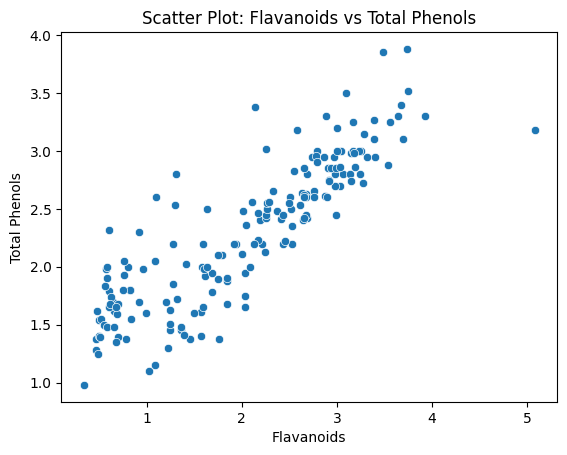
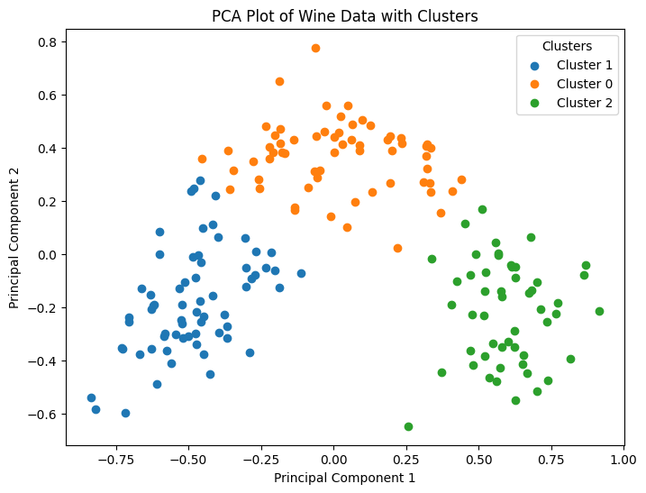
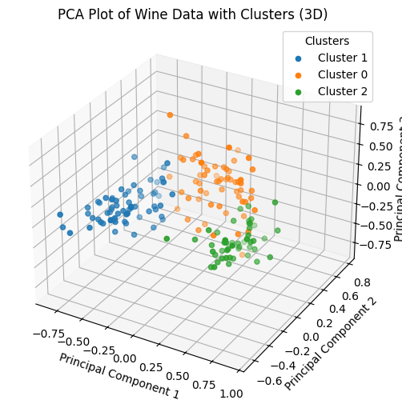

## <h1 align ="center"> Wine Clusterin Project </h1>

The *Wine Clustering Project* endeavors to explore and analyze a dataset encompassing various attributes of different types of wines. 

By employing data analysis techniques and unsupervised learning algorithms such as KMeans clustering and Principal Component Analysis (PCA), the project seeks to uncover hidden patterns and structures within the dataset. 

Some curious pattern to see is the potential positive linear relationship between attributes like flavanoids and total_phenols:

 Through this analysis, we aim to gain insights into the characteristics of different types of wines and potentially identify distinct clusters based on their attributes. At the end, we perform a KMeans Algorithm to cluster the different types, resulting in clear visualizations like the PCA plots shown below

 
As demonstrated, the clustering is well done, offering valuable insights into the underlying structure of the data

## Dataset
The Wine dataset is available for download [here](https://storage.googleapis.com/the_public_bucket/wine-clustering.csv)

## Analysis Details
For a detailed analysis, you can refer to the EDA and Unsupervised Learning notebooks by pressing [here](https://github.com/Gabrielnm7/Wine-Clustering/blob/main/EDA.ipynb)

## Environment
<pre><code>Python 3.9.5 
Numpy 1.23.0
Pandas 1.4.3
Matplotlib 3.6.2
Seaborn 0.12.2
Scikit Learn 1.2.2
</code></pre>

